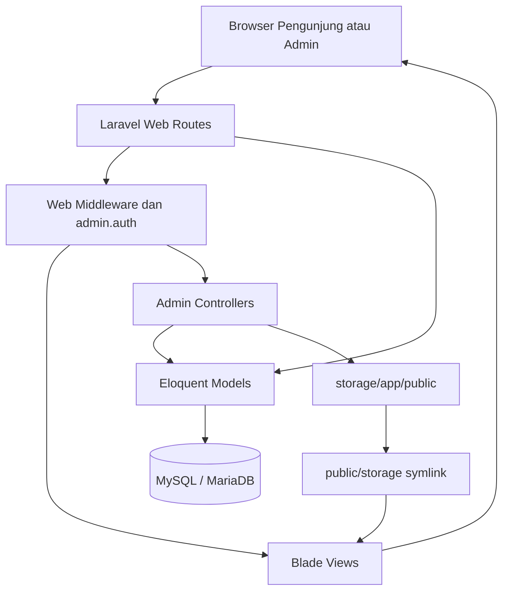
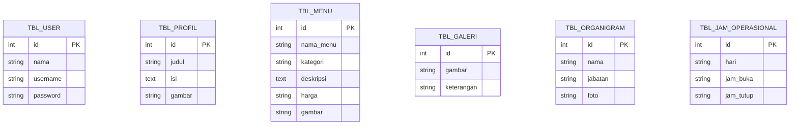

# Arsitektur Cafe Candaria

Dokumen ini menjelaskan struktur teknis dan alur aplikasi Cafe Candaria berdasarkan implementasi yang ada di repository. Aplikasi dibangun sebagai monolith Laravel dengan rendering Blade di server, database relasional, session untuk panel admin, dan penyimpanan file lokal.

## 1. Ringkasan Sistem

Cafe Candaria memiliki dua area utama:

1. **Area publik** untuk pengunjung cafe. Halaman utama membaca profil, menu, jam operasional, organigram, dan galeri dari database.
2. **Area admin** untuk mengelola konten. Semua route di bawah prefix `/admin` dilindungi middleware `admin.auth`.

Laravel menangani routing, validasi request, session, ORM Eloquent, migration, dan rendering Blade. Tidak ada frontend SPA atau service API domain khusus pada implementasi saat ini.

## 2. Diagram Komponen



## 3. Struktur Direktori dan Tanggung Jawab

### `routes/`

- `web.php` mendefinisikan halaman publik, login/logout, dashboard, dan CRUD admin.
- `api.php` saat ini hanya menyediakan `GET /api/user` dengan middleware `auth:sanctum`.

### `app/Http/Controllers/`

Controller admin berada di `app/Http/Controllers/Admin/`:

- `AuthController`: form login, validasi kredensial, session admin, dan logout.
- `ProfilController`: memastikan satu profil tersedia, lalu mengelola judul, sejarah, dan foto profil.
- `MenuController`: CRUD menu dan upload gambar menu.
- `GaleriController`: CRUD galeri dan upload gambar galeri.
- `OrganigramController`: CRUD data pengurus dan foto pengurus.
- `JamOperasionalController`: edit dan hapus jam operasional.

Controller juga menjadi batas validasi input dan pengelolaan file lama pada disk `public`.

### `app/Models/`

Model domain menggunakan Eloquent dengan nama tabel eksplisit karena tabel database memakai prefix `tbl_`. Model domain tidak memakai timestamp Laravel.

`Profil` memiliki accessor dan mutator `sejarah` yang memetakan nama field view ke kolom database `isi`.

### `resources/views/`

Blade view dibagi menjadi:

- `beranda.blade.php`: halaman publik utama.
- `detailmenu.blade.php`: daftar menu lengkap.
- `admin/*.blade.php`: login, dashboard, daftar data, form tambah/edit, dan halaman konfirmasi hapus.

Sebagian asset halaman publik dan admin dipanggil langsung dari `public/css`, `public/js`, dan `public/images`. Konfigurasi Vite tetap tersedia untuk asset pada `resources/css` dan `resources/js`.

### `database/`

- `migrations/` membuat tabel framework Laravel dan tabel domain Cafe Candaria.
- `seeders/DatabaseSeeder.php` membuat akun admin, profil awal, jadwal awal, dan beberapa menu contoh secara idempotent berdasarkan pengecekan data.

## 4. Alur Request Publik

### Halaman utama `/`

1. Route closure pada `routes/web.php` mengambil `Profil::first()`, `Menu::all()`, `JamOperasional::all()`, `Organigram::all()`, dan `Galeri::all()`.
2. Data dikirim ke `resources/views/beranda.blade.php`.
3. Blade merender section profil, organigram, menu, jadwal, dan galeri.
4. Jika collection kosong, view memakai fallback text atau gambar bawaan tertentu.
5. URL gambar upload dibentuk dari `public/storage`, sedangkan menu/galeri tanpa gambar memakai fallback gambar eksternal `picsum.photos`.

### Halaman `/detailmenu`

Route mengambil semua `Menu` lalu merender `detailmenu.blade.php`. Halaman ini tidak membutuhkan autentikasi.

## 5. Alur Request Admin

Semua route dashboard dan modul admin berada dalam alur berikut:

```text
/admin/*
  -> middleware web
  -> middleware admin.auth
  -> controller admin
  -> model Eloquent / Storage
  -> redirect kembali dengan flash message
```

`AdminAuth` memeriksa `session('admin_id')`. Jika session tidak ada, request dialihkan ke route `admin.login` dengan pesan error.

### Login

1. `GET /admin/login` menampilkan form login.
2. `POST /admin/login` memvalidasi `username` dan `password`.
3. `AuthController` mencari `AdminUser` berdasarkan username.
4. Password diverifikasi menggunakan `Hash::check`.
5. Session diregenerasi dan menyimpan `admin_id` serta `admin_nama`.
6. Admin dialihkan ke `/admin/dashboard`.

Login ini adalah mekanisme session manual. `config/auth.php` masih menggunakan provider default `App\\Models\\User`, sehingga `AdminUser` tidak dipasang sebagai guard default Laravel.

### Logout

`POST /logout` menghapus `admin_id` dan `admin_nama`, meregenerasi session, lalu mengarahkan pengguna ke halaman login.

## 6. Modul dan Operasi Data

| Modul | Model | Tabel | Input utama | Dukungan file |
| --- | --- | --- | --- | --- |
| Profil | `Profil` | `tbl_profil` | `judul`, `sejarah` | `foto` opsional |
| Menu | `Menu` | `tbl_menu` | `nama_menu`, `kategori`, `deskripsi`, `harga` | `gambar` opsional |
| Galeri | `Galeri` | `tbl_galeri` | `keterangan` | `gambar` wajib saat create |
| Organigram | `Organigram` | `tbl_organigram` | `nama`, `jabatan` | `foto` opsional |
| Jam operasional | `JamOperasional` | `tbl_jam_operasional` | `hari`, `jam_buka`, `jam_tutup` | Tidak ada |

Operasi create/update yang menerima file menggunakan `store(..., 'public')`. Saat update dengan file baru, controller menghapus file lama bila file tersebut masih ada. Saat delete, record dan file terkait dihapus.

## 7. Model Data



Tabel domain berdiri sendiri dan tidak memiliki foreign key antar modul. Relasi bisnisnya bersifat agregasi pada halaman utama, bukan relasi Eloquent antar model.

### Catatan schema

- Semua tabel domain menggunakan integer auto-increment sebagai primary key.
- Tabel domain tidak mempunyai `created_at` atau `updated_at`.
- `harga` disimpan sebagai string dengan panjang maksimal 20 karakter agar dapat menyimpan format tampilan seperti `2.000`.
- Field `kategori` ditambahkan melalui migration terpisah dan divalidasi controller sebagai `Makanan` atau `Minuman`.
- Field `gambar` menu ditambahkan melalui migration terpisah.

## 8. Keamanan dan Middleware

### Middleware web

Group `web` mengaktifkan cookie terenkripsi, session, CSRF protection, validasi error dari session, dan route model binding.

### Middleware admin

Alias `admin.auth` didefinisikan pada `app/Http/Kernel.php` dan hanya memeriksa keberadaan `admin_id` pada session. Authorization berbasis role atau multi-admin belum tersedia.

### Validasi upload

Controller membatasi upload menjadi image dengan ekstensi JPEG, PNG, JPG, GIF, SVG, atau WebP dan ukuran maksimal 5120 KB. Nama file disimpan sebagai path hasil Laravel Storage, bukan input mentah dari pengguna.

### Hal yang perlu diperkuat sebelum production

- Ganti kredensial seed `admin/admin123`.
- Tambahkan rate limiting untuk percobaan login.
- Pertimbangkan guard/provider khusus `AdminUser` jika autentikasi akan diperluas.
- Tambahkan authorization per akun bila ada lebih dari satu jenis admin.
- Review penerimaan SVG jika deployment membutuhkan pembatasan tipe file yang lebih ketat.
- Tambahkan audit log untuk perubahan konten penting.

## 9. Konfigurasi dan Runtime

Konfigurasi utama berada di `.env` dan `config/*.php`.

Default development yang relevan:

- Database: MySQL pada `127.0.0.1:3306`.
- Session: file.
- Cache: file.
- Queue: sync.
- Filesystem default: local; upload konten secara eksplisit memakai disk `public`.
- API throttle: 60 request per menit berdasarkan user atau IP.

Laravel dijalankan dari `public/index.php`. Web server production harus menggunakan folder `public` sebagai document root agar file konfigurasi dan source code tidak terekspos.

## 10. API Surface

API domain belum diimplementasikan. Endpoint yang tersedia dari `routes/api.php` adalah:

| Method | Path | Middleware | Fungsi |
| --- | --- | --- | --- |
| GET | `/api/user` | `auth:sanctum` | Mengembalikan user yang sedang terautentikasi |

Endpoint tersebut tidak digunakan oleh halaman publik atau panel admin saat ini.

## 11. Testing dan Quality Gates

Test saat ini masih berupa smoke test:

- `tests/Feature/ExampleTest.php` memeriksa `GET /` menghasilkan status 200.
- `tests/Unit/ExampleTest.php` memeriksa assertion dasar PHPUnit.

Perubahan pada modul sebaiknya menambah pengujian untuk guest pada route admin, login berhasil dan gagal, validasi CRUD, upload dan penghapusan file, rendering data database pada halaman publik, serta seeder pada database kosong.

Perintah pemeriksaan standar:

```bash
php artisan test
vendor/bin/pint --test
npm run build
```

## 12. Keputusan Implementasi dan Batasan

1. **Blade monolith** dipakai karena kebutuhan aplikasi berpusat pada halaman informasi dan CRUD sederhana.
2. **Tabel dengan nama eksplisit** dipertahankan agar kompatibel dengan schema `tbl_*` yang sudah digunakan.
3. **Session manual untuk admin** menjaga implementasi login tetap sederhana, tetapi belum memanfaatkan guard Laravel khusus.
4. **File lokal** cukup untuk development dan deployment sederhana; object storage diperlukan bila aplikasi berskala lebih besar atau berjalan di beberapa instance.
5. **Route closure** dipakai untuk halaman publik dan dashboard, sedangkan operasi mutasi dipisahkan ke controller admin.
6. **Fallback view** menjaga halaman tetap memiliki isi ketika database belum diisi, tetapi data fallback tersebut bukan pengganti seeding production.

## 13. Panduan Perubahan Kode

Saat menambah modul konten baru, ikuti urutan berikut:

1. Buat migration untuk tabel dengan primary key dan field yang dibutuhkan.
2. Buat model dengan `$table`, `$primaryKey`, `$timestamps = false`, dan `$fillable` yang sesuai.
3. Buat controller admin dengan validasi request dan Storage bila ada file.
4. Daftarkan route dalam group `admin.auth`.
5. Buat view daftar dan form tambah/edit/hapus.
6. Hubungkan data ke halaman publik bila modul tersebut ditampilkan pengunjung.
7. Tambahkan seeder bila data awal diperlukan.
8. Tambahkan feature test untuk akses, validasi, dan alur utama.
9. Jalankan test, Pint, dan build asset sebelum deployment.
